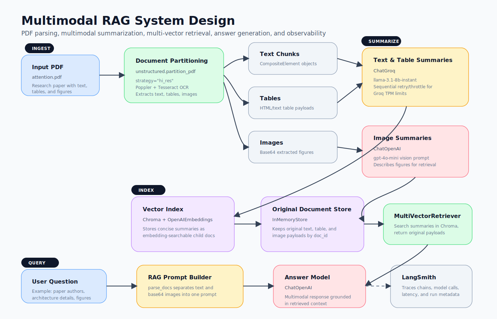

# Multimodal RAG with LangChain

This project builds a multimodal retrieval-augmented generation (RAG) pipeline over a research paper PDF. It extracts text, tables, and images from the PDF, creates summaries for retrieval, indexes those summaries in Chroma, and answers user questions with the original multimodal context.



## What The System Does

- Parses `attention.pdf` with `unstructured.partition_pdf` using the `hi_res` strategy.
- Uses Poppler and Tesseract for PDF rendering and OCR support.
- Separates extracted content into text chunks, tables, and images.
- Summarizes text and table chunks with Groq (`llama-3.1-8b-instant`).
- Summarizes images with OpenAI vision (`gpt-4o-mini`).
- Stores summaries in a Chroma vector index using OpenAI embeddings.
- Keeps original text, table, and image payloads in an in-memory doc store.
- Uses `MultiVectorRetriever` to retrieve original content through summary embeddings.
- Builds a multimodal prompt and answers questions with a LangChain RAG chain.
- Sends LangChain run traces to LangSmith for observability.

## System Flow

1. `attention.pdf` is partitioned into structured elements: text, tables, and images.
2. Text and table elements are summarized into concise retrieval-friendly documents.
3. Image payloads are summarized so figures can also participate in semantic retrieval.
4. Summaries are embedded and stored in Chroma as child documents.
5. Original multimodal elements are stored separately and linked by `doc_id`.
6. A user question searches Chroma, retrieves matching original payloads, and constructs a final multimodal prompt.
7. The answer model responds using only the retrieved context.
8. LangSmith records traces for debugging latency, model calls, prompts, and chain behavior.

## Main Notebook

The primary notebook is:

```text
langchain_multimodal.ipynb
```

Important sections:

- `SetUp`: installs Python dependencies and validates system tools.
- `Extract the data`: partitions the PDF into text, tables, and images.
- `Summarize the data`: creates text/table/image summaries.
- `Load data and summaries to vectorstore`: creates the Chroma-backed multi-vector retriever.
- `RAG pipeline`: builds the final multimodal retrieval and answer chain.

## Required System Tools

On macOS, install the required native tools with Homebrew:

```bash
brew install poppler tesseract libmagic
```

These provide:

- `pdfinfo` and PDF rendering tools from Poppler.
- OCR support from Tesseract.
- File type detection through libmagic.

## Python Environment

The project uses a local virtual environment:

```text
venv/
```

Install notebook dependencies with:

```bash
pip install --upgrade pip
pip install --no-compile -U unstructured unstructured-pytesseract pypdf pdfminer.six pi-heif unstructured-inference pdf2image pillow lxml --only-binary pi-heif
pip install -U chromadb tiktoken
pip install -U langchain langchain-community langchain-openai langchain-groq langsmith
pip install -U python-dotenv
```

## Environment Variables

Create a `.env` file in this folder with the keys used by the notebook:

```text
OPENAI_API_KEY=...
GROQ_API_KEY=...
HF_TOKEN=...
LANGSMITH_API_KEY=...
LANGSMITH_TRACING=true
LANGSMITH_PROJECT=advanced-rag-notebook
```

The notebook also supports older names like `HF_API_KEY` and `LANGCHAIN_API_KEY` by mapping them to the current expected environment variables.

## Observability

LangSmith tracing is enabled in the setup cell. Runs should appear under:

```text
advanced-rag-notebook
```

Use LangSmith to inspect prompts, retrieved context, model calls, errors, token usage, and latency.

## Notes

- Groq free/on-demand tiers have low token-per-minute limits, so the notebook summarizes sequentially with retry logic.
- `strategy="hi_res"` requires Poppler and OCR-related dependencies.
- Chroma stores summary embeddings, while the in-memory doc store keeps the original multimodal elements returned to the final RAG prompt.
